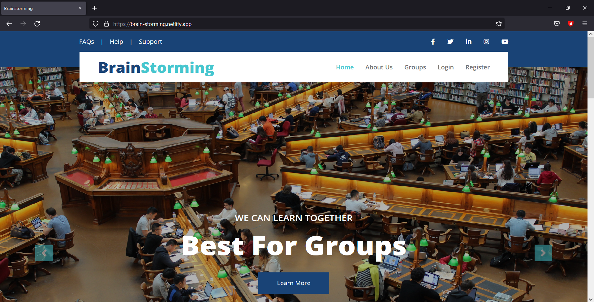
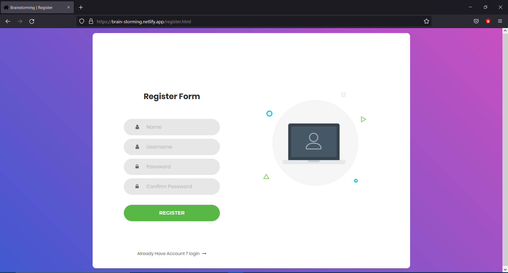
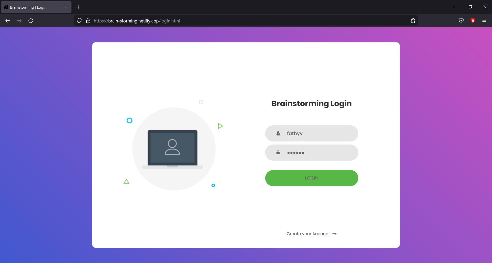
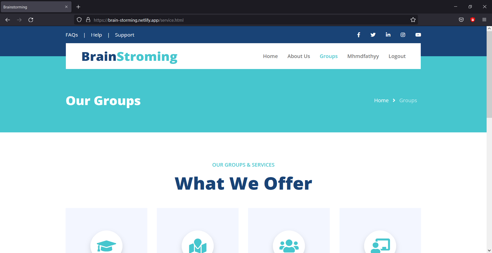
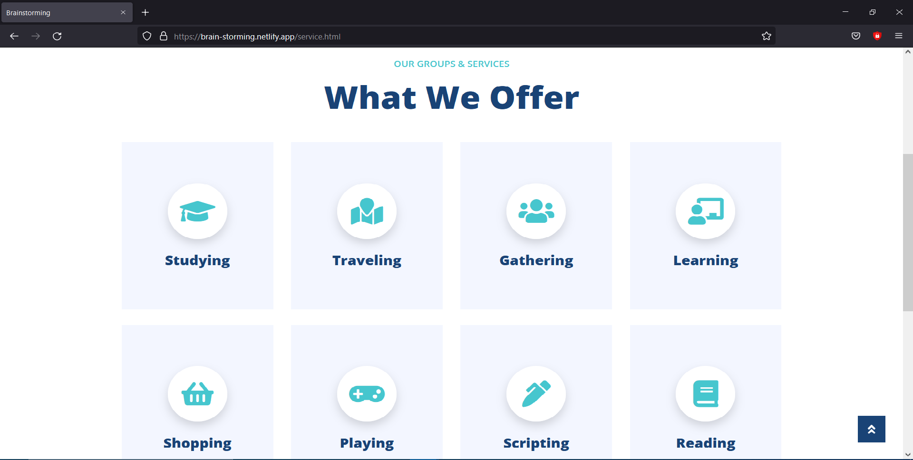
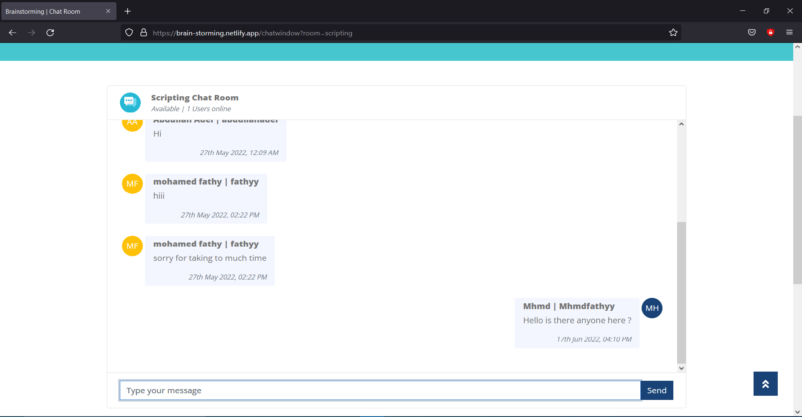

# BrainStorming

**Note: This was a freelancing project. So, all rights are reserved to the owner of the project.**

<div align="center">

[](https://github.com/mhmdahmedfathi/BrainStorming/contributors)
[](https://github.com/mhmdahmedfathi/BrainStorming/issues)
[](https://github.com/mhmdahmedfathi/BrainStorming/network)
[](https://github.com/mhmdahmedfathi/BrainStorming/stargazers)
[](https://github.com/mhmdahmedfathi/BrainStorming/blob/main/LICENSE)
</div>

## Table of contents

- [About](#about)
- [Built with](#built-with)
- [screenshots](#screenshots)
- [Prerequisites](#prerequisites)
- [Get started](#get-started)

## About

BrainStorming is a platform where people with same interests can join group char rooms of certain topics and exchange their experiences.

## Built with

- [HTML](https://developer.mozilla.org/en-US/docs/Web/HTML)
- [CSS](https://developer.mozilla.org/en-US/docs/Web/CSS)
- [JavaScript](https://developer.mozilla.org/en-US/docs/Web/JavaScript)
- [Nodejs](https://nodejs.org/en/)
- [Socket.io](https://socket.io/)

##  screenshots

<div name="Screenshots" align="center">
    When you open index.html,you will see
   
   <hr>
   If you Don't have account,you can sign up by clicking the Register.
    
    <hr>
    If you have account,you can sign in by clicking the Login.
    
    <hr>
    This is the main page of the app after being logged in.
    
    <hr>
    If you want to join any room, you can click the Groups button.
    
    <hr>
    You will see a list of rooms, you can click on any room according to the topic you want to join it.
    
    <hr>
    Congratulations! you can start chatting with your friends at this topic.
    
    <hr>
</div>


## Prerequisites

You just have to make sure that you have **[Nodejs](https://nodejs.org/en/)** installed on your computer!

## Get started

1. Clone the repository
	```
	git clone https://github.com/mhmdahmedfathi/BrainStorming
	```
2. Navigate to the project's folder
	```
	cd BrainStroming
	```
3. Navigate to the client's folder, and open **index.html** in the browser
	```
	cd client && start index.html
	```
4. Navigate to the server's folder
	```
	cd server
	```
5. Install the needed dependencies
	```
	npm install
	```
6. Start the server
	```
	npm start
	```


